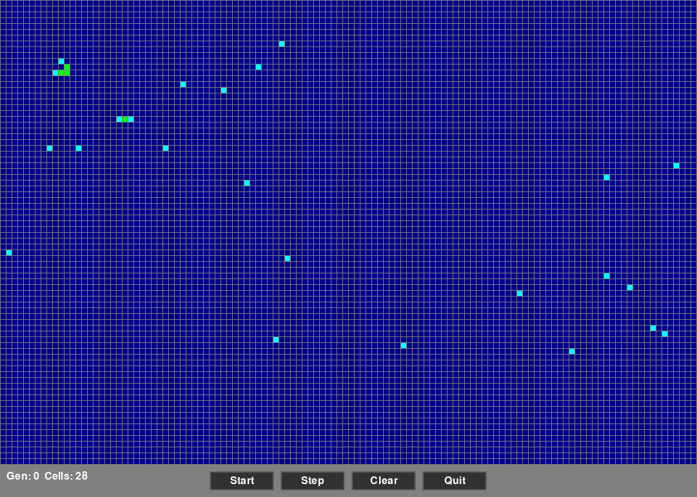

# Game of Life

A Conway's Game of Life implementation with both Python (Pygame) and JavaScript (HTML/Canvas) versions.

## Overview

This project implements Conway's Game of Life, a cellular automaton where cells evolve based on simple rules:
- A live cell with 2-3 live neighbors survives
- A dead cell with exactly 3 live neighbors becomes alive
- All other cells die or stay dead

## Screenshot



## Features

- **Color-coded cell visualization**: Cells are colored based on their neighbor count
  - Cyan: 0-1 neighbors (lonely/underpopulated)
  - Green: 2-3 neighbors (stable/healthy)
  - Orange: 4+ neighbors (crowded/overpopulated)
- **Interactive grid editing**: Click to toggle cells, right-click to kill cells
- **Playback controls**: Start, Stop, Step, Clear
- **Generation counter**: Tracks the number of generations
- **Active cell counter**: Shows the number of living cells
- **High performance**: Numba-compiled neighbor counting in Python; optimized Canvas rendering in JavaScript

## Versions

### Python Version (life.py)
- Built with Pygame
- Grid size: 120x80 cells
- Cell size: 8 pixels with 1px margins
- FPS: 60
- Uses NumPy with Numba JIT compilation for fast computation

**Requirements:**
```bash
pip install pygame numpy numba
```

**Run:**
```bash
python life.py
```

### Web Version (index.html)
- Pure HTML5, CSS3, and JavaScript
- No dependencies required
- Same grid size and features as Python version
- Uses Canvas API for rendering

**Run:**
Open `index.html` in any modern web browser.

## Controls

### Mouse
- **Left Click**: Toggle cell (alive ↔ dead)
- **Right Click**: Kill cell (set to dead)

### Buttons
- **Start**: Begin the simulation
- **Stop**: Pause the simulation
- **Step**: Advance one generation (only when paused)
- **Clear**: Reset grid to empty and counter to 0
- **Patterns**: Open pattern selection menu
- **Quit**: Exit the application

## Pattern Library

Both versions include 28 preset patterns organized by category:

### Oscillators (Period-N patterns)
- **Blinker** (Period-2): Simplest oscillator, alternates between horizontal and vertical
- **Toad** (Period-2): Two staggered lines that flip
- **Beacon** (Period-2): Four-block pattern with pulsing corners
- **Pulsar** (Period-3): 15x15 symmetric pattern, complex and beautiful
- **Penta-Decathlon** (Period-15): Rare oscillator with 15-generation period

### Spaceships (Moving patterns)
- **Glider**: Classic lightweight spaceship, moves diagonally
- **LWSS** (Lightweight): Faster horizontal spaceship
- **MWSS** (Middleweight): Medium-speed horizontal spaceship
- **HWSS** (Heavyweight): Larger horizontal spaceship

### Still Lifes (Stable patterns)
- **Block**: Simple 2x2 square
- **Tub**: Diamond shape surrounded by empty space
- **Beehive**: Hexagonal cluster
- **Loaf**: House-like shape
- **Boat**: Triangle formation
- **Pond**: Two beehives in contact
- **Ship**: Extended boat variant
- **Aircraft**: Asymmetric stable configuration

### Guns & Puffers
- **Gosper Glider Gun**: Famous pattern that continuously generates gliders!

### Chaotic/Evolving Patterns
- **Beehive with Tail**: Still life with evolving extension
- **Pi Heptomino**: 7-cell pattern with complex evolution
- **B Heptomino**: 7-cell pattern with dramatic growth
- **Acorn**: 7-cell pattern that slowly grows to 633 cells
- **Die Hard**: 8-cell pattern that dies completely in 130 generations

## Project Structure

```
Life/
├── life.py          # Python implementation with Pygame
├── index.html       # Web version with embedded JavaScript
├── README.md        # This file
└── claude.md        # Development notes and current state
```

## Performance

Both implementations run at 60 FPS:
- Python version uses Numba's parallel JIT compilation for fast neighbor counting
- JavaScript version uses optimized Canvas rendering with requestAnimationFrame

## Browser Compatibility

The web version works in all modern browsers that support:
- HTML5 Canvas
- ES6 JavaScript
- CSS3 Flexbox

## Future Improvements

Possible enhancements:
- Save/Load custom grid patterns to JSON
- Zoom and pan controls
- Variable speed/FPS adjustment
- Color theme customization
- Export to image or animation format
- Keyboard shortcuts (Space=Start/Stop, C=Clear, etc.)
- Touch support for mobile web version
- Statistics display (population history graph)
